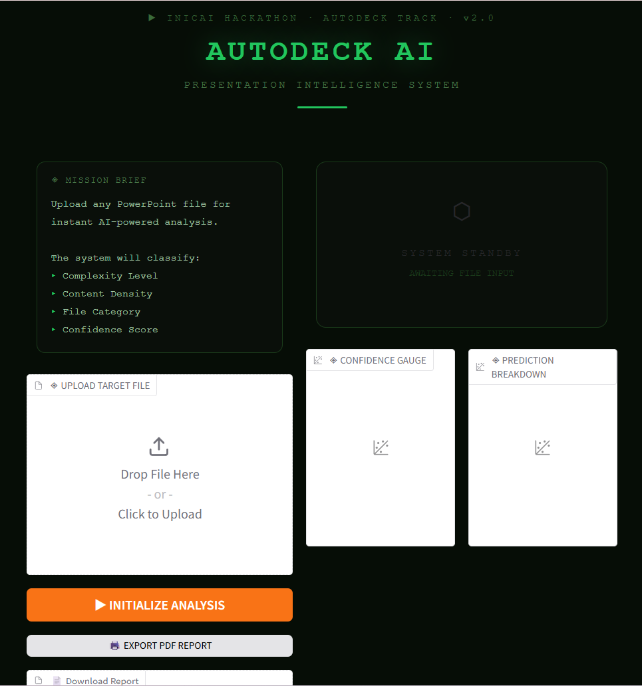
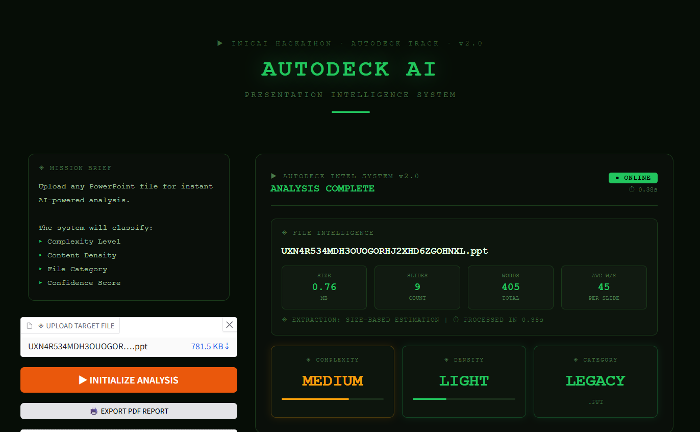
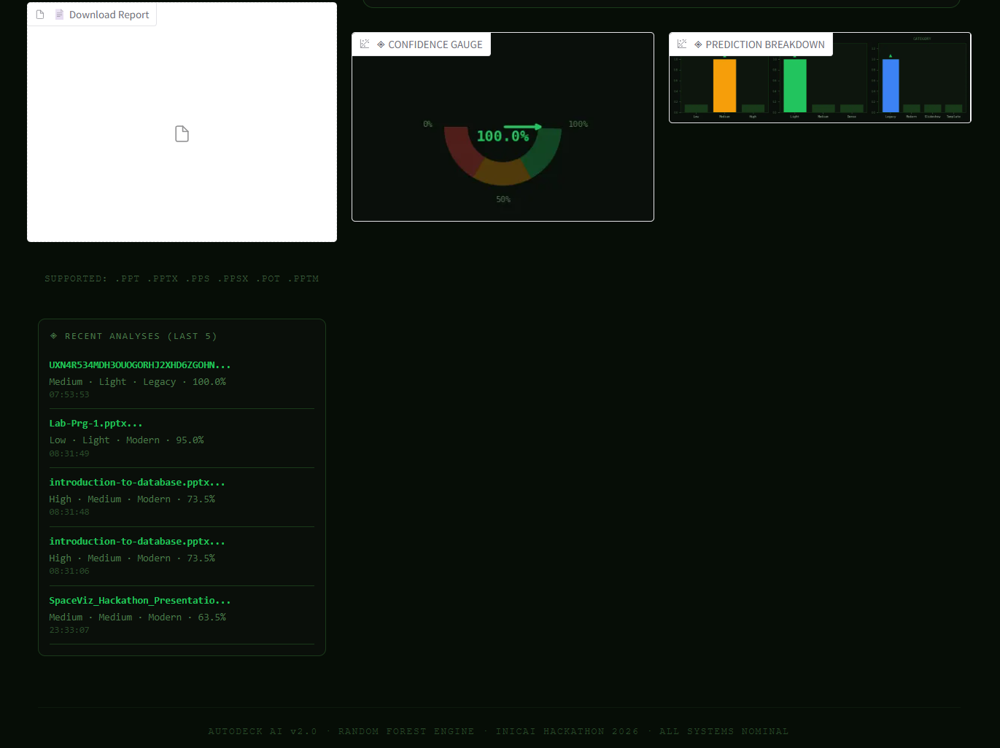

# 🎯 AutoDeck AI — Presentation Intelligence System

<!-- 
  📸 IMAGE 1: Place a banner image here
  - Take a full screenshot of your Hugging Face demo (the whole page)
  - Save it as: assets/banner.png
  - Recommended size: 1200x600px
-->


<div align="center">

[](https://huggingface.co/spaces/Drax369/autodeck-ai)
[](https://www.kaggle.com/code/dhanush3691/notebook984cb4990c)
[](https://github.com/Drax369/autodeck-ai)
[]()

**Built for the INICAI AI Multi-Domain Hackathon | AutoDeck AI Track | May 2026**

</div>

---

## 📌 Overview

AutoDeck AI is an end-to-end ML pipeline that analyzes PowerPoint presentations and classifies them across 5 dimensions using a Random Forest model trained on 698 real US government presentations.

| Prediction | Classes |
|---|---|
| ⚡ Complexity | Low / Medium / High |
| 🌊 Content Density | Light / Medium / Dense |
| 🗂️ File Category | Legacy / Modern / Slideshow / Template |
| ✅ Quality Score | 0 - 100 |
| 🎯 Confidence | Model probability score |

---

## 🖥️ Live Demo

<!-- 
  📸 IMAGE 2: Place a screenshot of the analysis results here
  - Upload a file in the demo and take a screenshot showing the full results
  - Should show: ANALYSIS COMPLETE, file stats, complexity/density/category cards
  - Save it as: assets/demo_result.png
-->


<!-- 
  📸 IMAGE 3: Place a screenshot showing the gauge + bar charts here
  - Scroll down to show the confidence gauge and prediction breakdown charts
  - Save it as: assets/demo_charts.png
-->


👉 **Try it live:** [https://huggingface.co/spaces/Drax369/autodeck-ai](https://huggingface.co/spaces/Drax369/autodeck-ai)

---

## 🧠 How It Works

```
📂 Upload PowerPoint File
        │
        ▼
┌───────────────────────┐
│   Feature Extraction  │
│  ┌─────────────────┐  │
│  │ .pptx → Direct  │  │  (exact slide + word count)
│  │ .ppt  → Convert │  │  (LibreOffice batch conversion)
│  └─────────────────┘  │
└───────────────────────┘
        │
        ▼
┌───────────────────────┐
│   Random Forest ML    │
│  • 100 estimators     │
│  • Trained on 698     │
│    real PPT files     │
│  • Percentile-based   │
│    class boundaries   │
└───────────────────────┘
        │
        ▼
┌───────────────────────┐
│   Predictions +       │
│   Confidence Score    │
│   (model probability) │
└───────────────────────┘
        │
        ▼
  📊 Results Dashboard
  (Gauge + Charts + PDF)
```

---

## 🏗️ Architecture

### Feature Extraction Pipeline
- **Path A — Exact** (`.pptx`, `.ppsx`, `.pptm`): Direct extraction via `python-pptx` → exact slide count and word count
- **Path B — Conversion** (`.ppt` legacy): LibreOffice headless batch conversion to `.pptx` → then exact extraction
- **Path C — Estimation** (fallback): File-size calibrated estimation using data percentiles

### ML Model
- **Algorithm:** Random Forest Classifier (100 estimators, `random_state=42`)
- **Features:** `file_size_kb`, `file_size_mb`, `slide_count`, `word_count`, `avg_words_per_slide`
- **Label Strategy:** Percentile-based (33rd/66th) for balanced class distribution
- **Confidence:** Averaged prediction probabilities across complexity and density models

### Results
| Metric | Value |
|---|---|
| Training files | 698 |
| Test files | 150 (+ 998 full submission) |
| Exact extraction rate | 95.8% |
| Public leaderboard score | **0.56866** |

---

## ✨ Features

- 🎯 **Military tactical UI** — Dark theme command center aesthetic
- 📊 **Confidence gauge** — Semicircular meter showing model certainty
- 📈 **Prediction breakdown** — Bar charts for all prediction classes
- 📋 **Analysis history** — Last 5 analyses shown in session
- ⏱️ **Processing time** — Real-time performance display
- 🖨️ **PDF export** — One-click downloadable analysis report
- 🌐 **Multi-format support** — `.ppt`, `.pptx`, `.pps`, `.ppsx`, `.pot`, `.pptm`

---

## 🚀 Run Locally

### Prerequisites
- Python 3.10+
- LibreOffice (for `.ppt` conversion)

### Setup

```bash
# Clone the repo
git clone https://github.com/Drax369/autodeck-ai.git
cd autodeck-ai

# Create virtual environment
python -m venv venv
venv\Scripts\activate  # Windows
# source venv/bin/activate  # Mac/Linux

# Install dependencies
pip install -r requirements.txt
```

### Run the Demo

```bash
python app.py
```

Open `http://127.0.0.1:7860` in your browser.

### Generate Predictions

```bash
# Extract training features
python extract_train.py

# Train the model
python train_model.py

# Generate predictions
python convert_and_predict.py
```

---

## 📁 Project Structure

```
autodeck-ai/
│
├── app.py                  # Gradio demo application
├── build.py                # Rule-based baseline classifier
├── convert_and_predict.py  # LibreOffice pipeline + ML predictions
├── extract_train.py        # Training feature extraction
├── train_model.py          # Random Forest model training
├── predict.py              # Prediction on test set
├── analyze.py              # Data exploration script
│
├── models.pkl              # Trained Random Forest models
├── train_features.csv      # Extracted training features
├── submission.csv          # Final predictions (998 rows)
│
├── requirements.txt        # Python dependencies
├── assets/                 # README images (see below)
│   ├── banner.png          # Full demo screenshot
│   ├── demo_result.png     # Analysis result screenshot
│   └── demo_charts.png     # Gauge + charts screenshot
│
└── data/                   # Dataset (not tracked in git)
    └── auto-deck-ai-systems-challenge/
```

---

## 📦 Requirements

```
gradio
scikit-learn
python-pptx
pandas
numpy
python-dotenv
matplotlib
fpdf2
```

---

## 🗂️ Dataset

**AutoDeck: AI-Powered Presentation Generation Challenge**
- 998 PowerPoint files from US Government web archives
- Formats: `.ppt`, `.pptx`, `.pps`, `.ppsx`, `.pot`, `.pptm`
- Split: 698 train / 150 val / 150 test
- Challenge: 97% legacy `.ppt` format with zero metadata

---

## 🏆 Hackathon

| Item | Details |
|---|---|
| Event | INICAI AI Multi-Domain Hackathon 2026 |
| Track | GenAI — AutoDeck AI |
| Score | 0.56866 (public leaderboard) |
| Demo | [Hugging Face Spaces](https://huggingface.co/spaces/Drax369/autodeck-ai) |
| Notebook | [Kaggle](https://www.kaggle.com/code/dhanush3691/autodeck-ai-presentation-intelligence-system) |

---

## 👤 Author

**Dhanush Madival**
- GitHub: [@Drax369](https://github.com/Drax369)
- LinkedIn: [dhanush-madival](https://linkedin.com/in/dhanush-madival-2286aa3b5/)
- Email: dhanush369coder@gmail.com

---

<div align="center">
Built with ❤️ for INICAI AI Multi-Domain Hackathon 2026
</div>